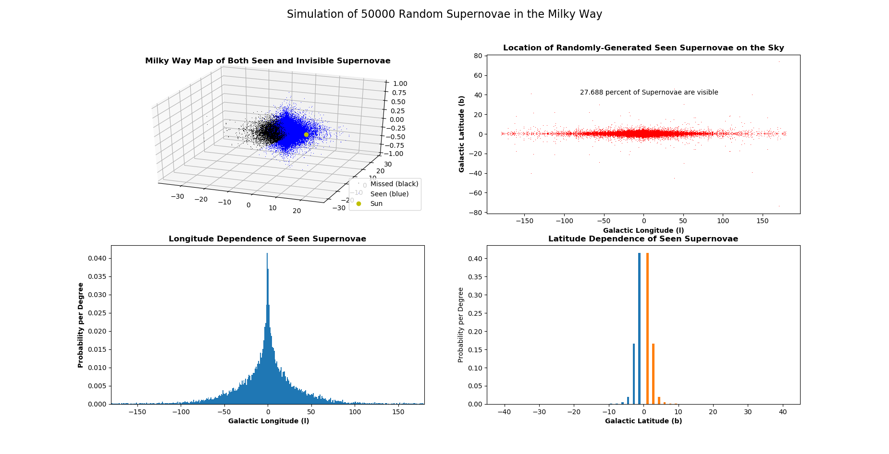

# Undergrad-Research

A select collection of the work I did in my my undergraduate at the University of Illinois, resulting in [this paper](https://arxiv.org/abs/2012.06552) which would go on to be published in [*Monthly Notices of the Royal Astronomical Society*](https://academic.oup.com/mnras/article-abstract/507/1/927/6330468?redirectedFrom=fulltext). The work centered around modeling both what fraction of supernovae (SNe) in the Milky Way we are likely to see and where to see it, building off of the models in [Adams, et. al., (2013)](https://arxiv.org/pdf/1306.0559.pdf).

## Setup
We start with the double exponential distribution given in the Adams paper, modelling both core-collapse supernove (CCSNe) and Type-Ia supernovae(IaSNe) individually, as well as dust. We use 3D density distributions following these double exponential models (see paper for equations as GiHub doesn't support them). We then use two different algorithms we developed to then calculate the probability of seeing any given supernovae and where on the sky in their own way.
## Integration
The integration method we use takes an array of signlines across the whole sky and calculates the distance from Earth along each sightline in which the given type of supernova is still visible. It does this by taking 10 parsec steps along the sightlines until the amount of light extinction is greater than the difference between the SN's absolute magnitude and the dimmest visible magnitude of the human eye. The collection of coordinates and points then become a surface on which to integrate in 3 dimensions on along. By integrating outward along the signlines first, we get the PDF representing the probability density map that shows where in the sky we are most likely to see supernovae. Integrating across this map then gives us the total probability of seeing any type of supernova when such type occurs.

## Monte Carlo
Each Monte Carlo Simulation works as follows: First, a set on 3*n* random values between 0 and 1, representing the random variable for the *r*, *theta*, and *z* coordinates for *n* simulated supernovae. These points are then scaled to follow their probability distributions, multiplying the theta variable by 2pi and performing a root finding algotrithm to scale the r and z. Each collection of (*r*, *z*, theta) is then individually analyzed to see if it would be seen from earth, located at (8.5kpc, 20pc, 0). While this method has larger variance and is more susceptible to random noise than the integration method, it has multiple benefits. The first is that it runs significantly faster, allowing us to shrink the varience down by simulating >1,000,000 points. Secondly, it is more easly applicable to similar questions, like "How does the probabilty change if we adjust the dimmest magnitude we can see?" 

### mc_sn.py
This program makes four subplots from a collection of 100,000 simulated SN points. The first is an rotatable 3D visualization of all of the supernovae. The visible ones are colored blue and Sun is added in as a reference point. The second is a 2-D plot of their view from Earth in Galactic coordinates. The third and fourth are latitude and longitude histograms of all of the points.

